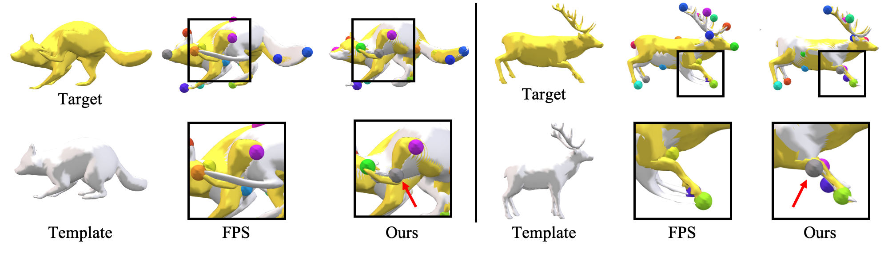

# OptCtrlPoints: Finding the Optimal Control Points for Biharmonic 3D Shape Deformation, Pacific Graphics 2023


[**arXiv**](https://arxiv.org/abs/2309.12899) | [**Project Page**](https://soulmates2.github.io/publications/OptCtrlPoints/) <br>
[Kunho Kim*](https://soulmate2.github.io/), [Mikaela Angelina Uy*](https://mikacuy.github.io/), [Despoina Paschalidou](https://paschalidoud.github.io/), [Alec Jacobson](https://www.cs.toronto.edu/~jacobson/),[Leonidas J. Guibas](https://geometry.stanford.edu/member/guibas/) [Minhyuk Sung](https://mhsung.github.io/) <br>


# Introduction
This repository contains the official implementation of **OptCtrlPoints: Finding the Optimal Control Points for Biharmonic 3D Shape Deformation**.<br>

**OptCtrlPoints** is a data-driven method to search for the optimal set of control points, enables accurate replication of the possible variations of a shape through biharmonic deformation.

[//]: # (### Abstract)
> We propose OptCtrlPoints, a data-driven framework designed to identify the optimal sparse set of control points for reproducing target shapes using biharmonic 3D shape deformation. Control-point-based 3D deformation methods are widely utilized for interactive shape editing, and their usability is enhanced when the control points are sparse yet strategically distributed across the shape. With this objective in mind, we introduce a data-driven approach that can determine the most suitable set of control points, assuming that we have a given set of possible shape variations. The challenges associated with this task primarily stem from the computationally demanding nature of the problem. Two main factors contribute to this complexity: solving a large linear system for the biharmonic weight computation and addressing the combinatorial problem of finding the optimal subset of mesh vertices. To overcome these challenges, we propose a reformulation of the biharmonic computation that reduces the matrix size, making it dependent on the number of control points rather than the number of vertices. Additionally, we present an efficient search algorithm that significantly reduces the time complexity while still delivering a nearly optimal solution. Experiments on SMPL, SMAL, and DeformingThings4D datasets demonstrate the efficacy of our method. Our control points achieve better template-to-target fit than FPS, random search, and neural-network-based prediction. We also highlight the significant reduction in computation time from days to approximately 3 minutes.

# Get Started
Our code is tested with Python 3.9, CUDA 11.7 and Pytorch 1.13.1.

## Installation
First, clone this repository:
```
git clone https://github.com/Soulmates2/OptCtrlPoints.git
cd OptCtrlPoints
```
Then you either can create a new conda environment:
```
conda env create -f env.yaml
conda activate optctrlpoints
```
or install essential packages into an existing environment:
```
pip install -r requirements.txt
```

## Dataset preparation
Please see the detail in [here](preprocessing/README.md)

## Run algorithm
After dataset preparation is done, you can run OptCtrlPoints by:
```
python experiments/run_optctrlpoints.py --config SMPL
python experiments/run_optctrlpoints.py --config SMAL
```
<!-- For other baselines, you can use these commands:
```
python experiments/run_fps.py --config SMPL
python experiments/run_random.py --config SMPL
``` -->
You can easily change the parameters by modifying config files.

# Citation
If you find our work useful, please consider citing:
```
@article {kim2023optctrlpoints,
    journal = {Computer Graphics Forum},
    title = {{OptCtrlPoints: Finding the Optimal Control Points for Biharmonic 3D Shape Deformation}},
    author = {Kim, Kunho and Uy, Mikaela Angelina and Paschalidou, Despoina and Jacobson, Alec and Guibas, Leonidas J. and Sung, Minhyuk},
    year = {2023},
    publisher = {The Eurographics Association and John Wiley & Sons Ltd.},
    ISSN = {1467-8659},
    DOI = {10.1111/cgf.14963}
}
```

# Acknowledgement
We use [SMPL](https://smpl.is.tue.mpg.de/), [SMAL](https://smal.is.tue.mpg.de/), and [DeformingThings4D](https://github.com/rabbityl/DeformingThings4D) dataset. The data preprocessing code is borrowed from [3D-CODED](https://github.com/ThibaultGROUEIX/3D-CODED/tree/master/data).
